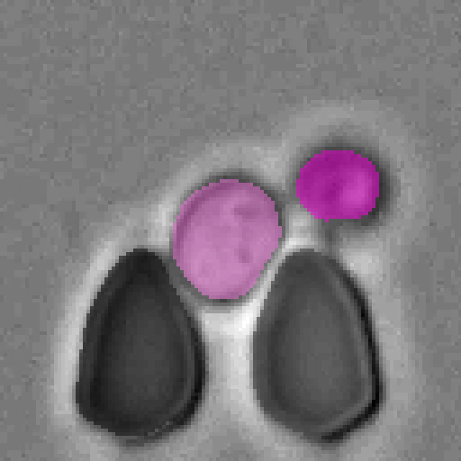
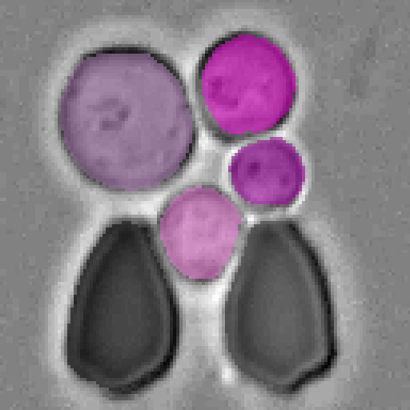
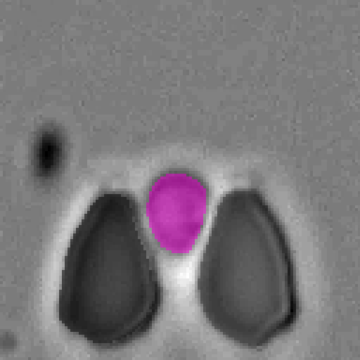
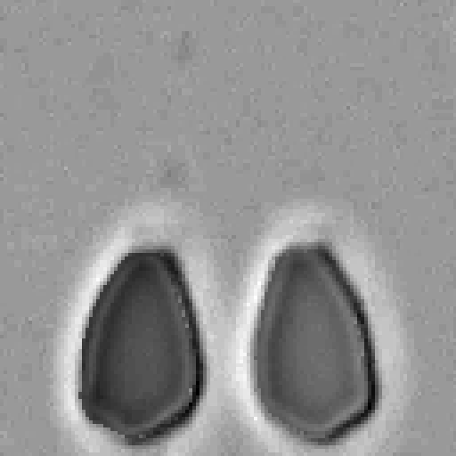
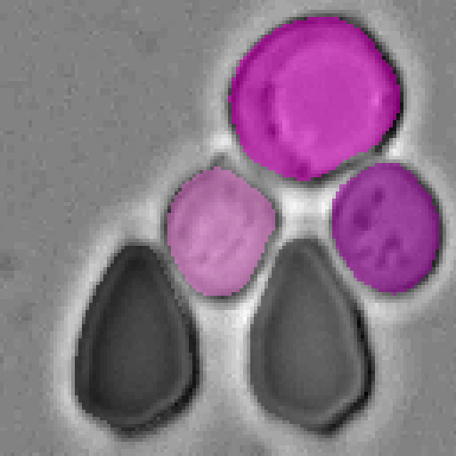
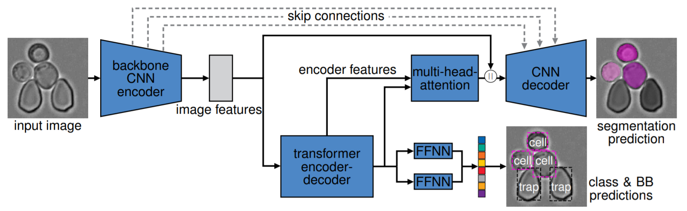

# Cell-DETR: Attention-Based Transformers for Instance Segmentation of Cells in Microstructures
[](https://arxiv.org/abs/2011.09763)
[](https://github.com/ChristophReich1996/Cell-DETR/blob/master/LICENSE)

**[Tim Prangemeier](https://www.bcs.tu-darmstadt.de/bcs_team/prangemeiertim.en.jsp), [Christoph Reich](https://github.com/ChristophReich1996) & [Heinz Koeppl](https://www.bcs.tu-darmstadt.de/bcs_team/koepplheinz.en.jsp)**

This repository includes the **official** and **maintained** implementation of the paper 
**[Attention-Based Transformers for Instance Segmentation of Cells in Microstructures](https://www.bcs.tu-darmstadt.de/media/bcs/research_4/documents/Prangemeier2020c_BIBM_cell-detr_accepted.pdf)** [(BIBM 2020)](https://ieeebibm.org/BIBM2020/).


<br/>

## Abstract
*Detecting and segmenting object instances is a common task in biomedical applications. Examples range from detecting 
lesions on functional magnetic resonance images, to the detection of tumours in histopathological images and extracting 
quantitative single-cell information from microscopy imagery, where cell segmentation is a major bottleneck. 
Attention-based transformers are state-of-the-art in a range of deep learning fields. They have recently been proposed 
for segmentation tasks where they are beginning to outperforming other  methods. We present a novel attention-based 
cell detection transformer (Cell-DETR) for direct end-to-end instance segmentation. While the segmentation performance 
is on par with a state-of-the-art instance segmentation method, Cell-DETR is simpler and faster. We showcase the 
method's contribution in a the typical use case of segmenting yeast in microstructured environments, commonly employed 
in systems or synthetic biology. For the specific use case, the proposed method surpasses the state-of-the-art tools 
for semantic segmentation and additionally predicts the individual object instances. The fast and accurate instance 
segmentation performance increases the experimental information yield for a posteriori data processing and 
makes online monitoring of experiments and closed-loop optimal experimental design feasible.*


## Architecture

<br/>Architecture of the end-to-end instance segmentation network, with brightfield specimen image input and an instance segmentation prediction as output.
The backbone CNN encoder extracts image features that then feed into both the transformer encoder-decoder for class and bounding box prediction, as well
as to the CNN decoder for segmentation. The transformer encoded features, as well as the transformer decoded features, are feed into a multi-head-attention
module and together with the image features from the CNN backbone feed into the CNN decoder for segmentation. Skip connections additionally bridge
between the backbone CNN encoder and the CNN decoder. Input and output resolution is 128 × 128 pixels.


## Dependencies
The Cell-DETR implementation uses multiple existing implementations. First, deformable convolutions v2 [2] are used based
on the [implementation](https://github.com/chengdazhi/Deformable-Convolution-V2-PyTorch/tree/pytorch_1.0.0) of 
[Dazhi Cheng](https://github.com/chengdazhi). Second, [pade activation units](https://arxiv.org/abs/1907.06732) [4] 
are utilized base on the [official implementation](https://github.com/ml-research/pau), by the authors. And third, the 
[pixel adaptive convolutions](https://arxiv.org/abs/1904.05373) [3] [implementation](https://github.com/NVlabs/pacnet) by 
[Nvidia](https://github.com/NVlabs) is used. The pade activation unit implementation as well as the pixel adaptive 
convolution implementation are adopted slightly and are included in this repository. All dependencies can be installed
by executing the following commands:

```shell script
git clone https://github.com/ChristophReich1996/Cell-DETR.git
cd Cell-DETR
pip install -r requirements.txt
git clone https://github.com/chengdazhi/Deformable-Convolution-V2-PyTorch
cd Deformable-Convolution-V2-PyTorch
git checkout pytorch_1.0.0
python setup.py build install
cd ../pade_activation_unit/cuda
python setup.py build install
```

The transformer [5] implementation is based on the 
[official implementation of DETR](https://github.com/facebookresearch/detr) [1].

## Usage
CELL-DETR can be trained, validated and testes by using the `main.py` script. The following command line arguments
define what actions are performed.

```
python main.py {+ args}
```

|Argument | Default value | Info|
|--- | --- | ---|
|`--train` | False | Binary flag. If set training will be performed.|
|`--val` | False | Binary flag. If set validation will be performed.|
|`--test` | False | Binary flag. If set testing will be performed.|
|`--cuda_devices` | "0" | String of cuda device indexes to be used. Indexes must be separated by a comma|
|`--data_parallel` | False | Binary flag. If multi GPU training should be utilized set flag.|
|`--cpu` | False | Binary flag. If set all operations are performed on the CPU.|
|`--epochs` | 200 | Number of epochs to perform while training.|
|`--lr_schedule` | False | Binary flag. If set the learning rate will be reduced after epoch 50 and 100.|
|`--ohem` | False | Binary flag. If set online heard example mining is utilized.|
|`--ohem_fraction` | 0.75 | Ohem fraction to be applied when performing ohem.|
|`--batch_size` | 4 | Batch size to be utilized while training.|
|`--path_to_data` | "trapped_yeast_cell_dataset" | Path to dataset.|
|`--augmentation_p` | 0.6 | Probability that data augmentation is applied on training data sample.|
|`--lr_main` | 1e-04 | Learning rate of the detr model (excluding backbone).|
|`--lr_backbone` | 1e-05 | Learning rate of the backbone network.|
|`--no_pac` | False | Binary flag. If set no pixel adaptive convolutions will be utilized in the segmentation head.|
|`--load_model` | "" | Path to model to be loaded.|
|`--dropout` | 0.0 | Dropout factor to be used in model.|
|`--three_classes` | False | Binary flag, If set three classes (trap, cell of interest and add. cells) will be utilized.|
|`--softmax` | False | Binary flag, If set a softmax will be applied to the segmentation prediction instead sigmoid.|
|`--only_train_segmentation_head_after_epoch` | 200 | Number of epoch where only the segmentation head is trained.|
|`--lr_segmentation_head` | 1e-05 | Learning rate of the segmentation head, only applied when seg head is trained exclusively.|
|`--no_deform_conv` | False | Binary flag. If set no deformable convolutions will be utilized.|
|`--no_pau` | False | Binary flag. If set no pade activation unit is utilized, however, a leaky ReLU is utilized.

For training, validating and testing of the Cell-DETR B architecture run 

```
python main.py --train --val --test --path_to_data "trapped_yeast_cell_dataset" --lr_schedule --batch_size 10 --data_parallel --cuda_devices "0, 1" --softmax
```

For training, validating and testing of the Cell-DETR A architecture run

```
python main.py --train --val --test --path_to_data "trapped_yeast_cell_dataset" --lr_schedule --batch_size 10 --data_parallel --cuda_devices "0, 1" --softmax --no_pac --no_deform_conv --no_pau
```

## Trained Models
Our trained models (Cell-DETR A & B) are included in the folder [`trained_models`](trained_models).

To load and test the trained Cell-DETR A model run

```
python main.py --test --path_to_data "trapped_yeast_cell_dataset" --cuda_devices "0" --softmax --no_pac --no_deform_conv --no_pau --load_model "trained_models/Cell_DETR_A"
```

to load and test the trained Cell-DETR B model run

```
python main.py --test --path_to_data "trapped_yeast_cell_dataset" --cuda_devices "0" --softmax --load_model "trained_models/Cell_DETR_B"
```


## Data
A few toy/test examples of the trapped yeast cell instance segmentation dataset are included in folder [`trapped_yeast_cell_dataset`](trapped_yeast_cell_dataset).
The full dataset can be requested from the [author's](tim.prangemeier@bcs.tu-darmstadt.de).

## Results

### Qualitative results


<br/>Example segmentations of our Cell-DETR B model.

### Segmentation results

| Model | Dice | Accuracy | mIoU (mean over instances) | Cell IoU |
| --- | --- | --- | --- | --- |
| Cell-DETR A | 0.92 | 0.96 |  0.84 | 0.83 |
| Cell-DETR B | 0.92 | 0.96 |  0.85 | 0.84 |


### Bounding box results

| Model | MSE | L1 | IoU | gIoU |
| --- | --- | --- | --- | --- |
| Cell-DETR A | 0.0006 | 0.016 | 0.81 | 0.80 |
| Cell-DETR B | 0.0005 | 0.016 | 0.81 | 0.81 |

### Classification results

| Model | Accuracy |
| --- | --- |
| Cell-DETR A | 1.0 |
| Cell-DETR B | 1.0 |

## Citation
If you find this research useful in your work, please acknowledge it appropriately and cite the paper:
```bibtex
@article{prangemeier2020c,
        title={Attention-Based Transformers for Instance Segmentation of Cells in Microstructures},
        author={Prangemeier, Tim and Reich, Christoph and Koeppl, Heinz},
        booktitle={2020 IEEE International Conference on Bioinformatics and Biomedicine (BIBM)},
        year={2020}
}
```

## References
```bibtex
[1] @article{carion2020end,
        title={End-to-End Object Detection with Transformers},
        author={Carion, Nicolas and Massa, Francisco and Synnaeve, Gabriel and Usunier, Nicolas and Kirillov, Alexander and Zagoruyko, Sergey},
        journal={arXiv preprint arXiv:2005.12872},
        year={2020}
}
```

```bibtex
[2] @inproceedings{zhu2019deformable,
        title={Deformable convnets v2: More deformable, better results},
        author={Zhu, Xizhou and Hu, Han and Lin, Stephen and Dai, Jifeng},
        booktitle={Proceedings of the IEEE Conference on Computer Vision and Pattern Recognition},
        pages={9308--9316},
        year={2019}
}
```

```bibtex
[3] @inproceedings{su2019pixel,
        title={Pixel-adaptive convolutional neural networks},
        author={Su, Hang and Jampani, Varun and Sun, Deqing and Gallo, Orazio and Learned-Miller, Erik and Kautz, Jan},
        booktitle={Proceedings of the IEEE Conference on Computer Vision and Pattern Recognition},
        pages={11166--11175},
        year={2019}
}
```

```bibtex
[4] @article{molina2019pad,
        title={Pad$\backslash$'e Activation Units: End-to-end Learning of Flexible Activation Functions in Deep Networks},
        author={Molina, Alejandro and Schramowski, Patrick and Kersting, Kristian},
        journal={arXiv preprint arXiv:1907.06732},
        year={2019}
}
```

```bibtex
[5] @inproceedings{vaswani2017attention,
        title={Attention is all you need},
        author={Vaswani, Ashish and Shazeer, Noam and Parmar, Niki and Uszkoreit, Jakob and Jones, Llion and Gomez, Aidan N and Kaiser, {\L}ukasz and Polosukhin, Illia},
        booktitle={Advances in neural information processing systems},
        pages={5998--6008},
        year={2017}
}
```
